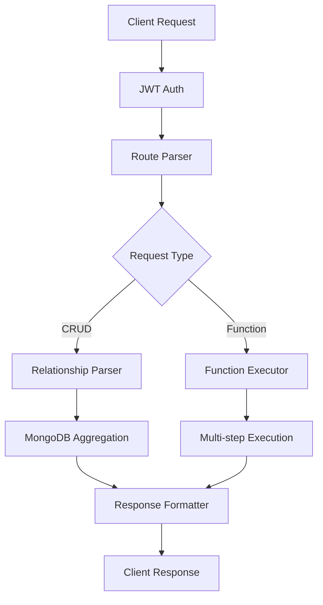

# MongoREST - Tài Liệu Kỹ Thuật

*Technical Documentation - Version 1.0.0*

---

## 📋 Mục Lục

1. [Kiến Trúc Chi Tiết](#kiến-trúc-chi-tiết)
2. [Schema System](#schema-system)
3. [Relationship System](#relationship-system)
4. [Query Processing](#query-processing)
5. [Security Implementation](#security-implementation)
6. [Performance Optimization](#performance-optimization)
7. [API Reference](#api-reference)

---

## 🏗️ Kiến Trúc Chi Tiết

### Core Components

#### 1. SchemaLoader
**Chức năng**: Load và validate tất cả schemas vào memory
- **Input**: JSON files trong `schemas/collections/` và `schemas/functions/`
- **Processing**: AJV validation, cross-reference checking
- **Output**: In-memory schema cache với compiled validators
- **Performance**: < 100ms loading time cho 50+ schemas

#### 2. CRUDGenerator  
**Chức năng**: Tự động tạo RESTful endpoints từ schemas
- **Input**: Collection schemas
- **Processing**: Route generation, middleware attachment
- **Output**: Fastify routes với full CRUD operations
- **Features**: Auto-validation, hooks, permissions

#### 3. RelationshipParser
**Chức năng**: Parse PostgREST-style relationship queries
- **Input**: Query strings như `select=name,orders(total,customer(name))`
- **Processing**: Recursive parsing, validation
- **Output**: MongoDB aggregation pipelines
- **Support**: 3+ levels nested relationships

#### 4. FunctionExecutor
**Chức năng**: Thực thi custom functions theo declarative workflow
- **Input**: Function definitions và parameters
- **Processing**: Step-by-step execution với data flow
- **Output**: Structured results với error handling
- **Features**: Rollback, caching, composition

### Data Flow Architecture



---

## 📋 Schema System

### Collection Schema Structure

```json
{
  "$schema": "http://json-schema.org/draft-07/schema#",
  "title": "Collection Name",
  "collection": "collection_name",
  "type": "object",
  "properties": {
    // Field definitions
  },
  "relationships": {
    // Relationship definitions
  },
  "indexes": [
    // MongoDB index definitions
  ],
  "mongorest": {
    // MongoREST specific configurations
  }
}
```

### Schema Validation Process

1. **Structure Validation**: Kiểm tra required fields
2. **Type Validation**: Validate field types và constraints  
3. **Reference Validation**: Check cross-collection references
4. **Index Validation**: Validate MongoDB index definitions
5. **Relationship Validation**: Check relationship configurations
6. **Permission Validation**: Validate permission configurations

### Schema Loading Optimization

```javascript
// Schemas được cache trong memory
const schemaCache = new Map();
const validatorCache = new Map();

// Pre-compiled validators cho performance
const validator = ajv.compile(schema);
validatorCache.set(collectionName, validator);
```

---

## 🔗 Relationship System

### Relationship Types Implementation

#### 1. BelongsTo (N-1)
```javascript
// Schema definition
"customer": {
  "type": "belongsTo",
  "collection": "users",
  "localField": "customerId", 
  "foreignField": "_id"
}

// Generated pipeline
[
  {
    $lookup: {
      from: "users",
      localField: "customerId",
      foreignField: "_id", 
      as: "customer"
    }
  },
  {
    $addFields: {
      customer: { $arrayElemAt: ["$customer", 0] }
    }
  }
]
```

#### 2. HasMany (1-N)
```javascript
// Schema definition  
"orders": {
  "type": "hasMany",
  "collection": "orders",
  "localField": "_id",
  "foreignField": "customerId",
  "pagination": { "defaultLimit": 20, "maxLimit": 100 }
}

// Generated pipeline
[
  {
    $lookup: {
      from: "orders", 
      localField: "_id",
      foreignField: "customerId",
      as: "orders",
      pipeline: [
        { $limit: 20 },
        { $sort: { createdAt: -1 } }
      ]
    }
  }
]
```

#### 3. ManyToMany (N-N)
```javascript
// Schema definition
"categories": {
  "type": "manyToMany",
  "collection": "categories",
  "through": "product_categories", 
  "localField": "_id",
  "throughLocalField": "productId",
  "throughForeignField": "categoryId",
  "foreignField": "_id"
}

// Generated pipeline  
[
  {
    $lookup: {
      from: "product_categories",
      localField: "_id", 
      foreignField: "productId",
      as: "categories_junction"
    }
  },
  {
    $lookup: {
      from: "categories",
      localField: "categories_junction.categoryId",
      foreignField: "_id",
      as: "categories"
    }
  }
]
```

### Query Parsing Algorithm

```javascript
// Parse process
1. Tokenize query string
2. Build AST (Abstract Syntax Tree)
3. Validate relationships
4. Generate aggregation pipeline
5. Optimize pipeline stages
6. Execute with MongoDB
```

### Relationship Query Examples

```javascript
// Basic embedding
GET /crud/orders?select=orderNumber,customer(name,email)

// Multiple relationships
GET /crud/users?select=name,orders(total),profile(avatar)

// Nested relationships (3 levels)
GET /crud/orders?select=id,customer(name,company(name,address))

// Filtering on relationships
GET /crud/users?orders.status=eq.completed&orders.total=gte.100

// Aggregated relationships
GET /crud/users?select=name,orderCount:orders!count,totalSpent:orders!sum(total)

// Many-to-many with filters
GET /crud/products?select=name,categories(name)&categories.featured=eq.true
```

---

## 🔍 Query Processing

### Filter System

#### Operator Support
```javascript
const operators = {
  'eq': (value) => ({ $eq: value }),
  'neq': (value) => ({ $ne: value }), 
  'gt': (value) => ({ $gt: parseValue(value) }),
  'gte': (value) => ({ $gte: parseValue(value) }),
  'lt': (value) => ({ $lt: parseValue(value) }),
  'lte': (value) => ({ $lte: parseValue(value) }),
  'in': (value) => ({ $in: parseArray(value) }),
  'nin': (value) => ({ $nin: parseArray(value) }),
  'like': (value) => ({ $regex: escapeRegex(value), $options: 'i' }),
  'regex': (value) => ({ $regex: value, $options: 'i' }),
  'exists': (value) => ({ $exists: parseBoolean(value) }),
  'null': (value) => parseBoolean(value) ? { $eq: null } : { $ne: null }
};
```

#### Value Parsing
```javascript
function parseValue(value) {
  // Auto-detect data types
  if (/^\d+$/.test(value)) return parseInt(value);
  if (/^\d+\.\d+$/.test(value)) return parseFloat(value);
  if (value === 'true') return true;
  if (value === 'false') return false;
  if (value === 'null') return null;
  if (/^[0-9a-fA-F]{24}$/.test(value)) return value; // ObjectId
  if (/^\d{4}-\d{2}-\d{2}/.test(value)) return new Date(value);
  return value;
}
```

### Aggregation Pipeline Optimization

#### Pipeline Stages Order
1. **$match** (early filtering)
2. **$lookup** (relationships)
3. **$addFields** (computed fields)
4. **$sort** (sorting)
5. **$skip** & **$limit** (pagination)
6. **$project** (field selection)

#### Performance Optimizations
- Move `$match` stages as early as possible
- Combine consecutive `$project` stages
- Add `$limit` to sub-pipelines for hasMany relationships
- Use indexes for `$lookup` operations
- Cache compiled pipelines

---

## 🔒 Security Implementation

### Authentication Flow

```javascript
// JWT Verification Process
1. Extract token from Authorization header
2. Verify token signature with secret key
3. Check token expiration
4. Extract user claims (role, permissions)
5. Store user context in request object
6. Proceed to authorization check
```

### Authorization Matrix

| Role | Collections | Operations | Functions | Rate Limit |
|------|-------------|------------|-----------|------------|
| **admin** | All | All | All | 10,000/h |
| **dev** | All | CRUD | Development | 5,000/h |
| **user** | Limited | Read/Create | User-specific | 1,000/h |
| **analyst** | Read-only | Read | Analytics | 500/h |

### Permission Checking Algorithm

```javascript
function checkPermission(user, collection, operation) {
  // 1. Check global permissions
  if (user.role === 'admin') return true;
  
  // 2. Check collection-level permissions
  const schema = getSchema(collection);
  const allowedRoles = schema.mongorest.permissions[operation];
  if (!allowedRoles.includes(user.role)) return false;
  
  // 3. Check relationship permissions
  if (hasRelationships(request)) {
    return checkRelationshipPermissions(user, relationships);
  }
  
  return true;
}
```

### Input Sanitization

```javascript
// Multi-layer sanitization
1. Schema validation (AJV)
2. MongoDB operator validation
3. XSS prevention
4. SQL injection prevention (for text search)
5. Size limits enforcement
6. Type coercion safety
```

---

## ⚡ Performance Optimization

### Memory Management

#### Schema Caching
```javascript
class SchemaCache {
  constructor() {
    this.schemas = new Map();        // Raw schemas
    this.validators = new Map();     // Compiled validators
    this.pipelines = new LRU(1000); // Cached pipelines
  }
  
  precompileValidators() {
    // Pre-compile all validators at startup
    for (const [name, schema] of this.schemas) {
      this.validators.set(name, ajv.compile(schema));
    }
  }
}
```

#### Connection Pooling
```javascript
const mongoOptions = {
  maxPoolSize: 50,           // Maximum connections
  minPoolSize: 5,            // Minimum connections  
  maxIdleTimeMS: 30000,      // Close after 30s idle
  serverSelectionTimeoutMS: 5000,
  socketTimeoutMS: 45000
};
```

### Query Optimization

#### Index Recommendations
```javascript
function generateIndexRecommendations(schemas) {
  const recommendations = [];
  
  for (const [collection, schema] of schemas) {
    // Relationship indexes
    if (schema.relationships) {
      for (const [name, rel] of Object.entries(schema.relationships)) {
        recommendations.push({
          collection: rel.collection,
          index: { [rel.foreignField]: 1 },
          reason: `Foreign key for ${name} relationship`
        });
      }
    }
    
    // Filter indexes
    const commonFilters = analyzeCommonFilters(collection);
    if (commonFilters.length > 0) {
      recommendations.push({
        collection,
        index: createCompoundIndex(commonFilters),
        reason: 'Common filter patterns'
      });
    }
  }
  
  return recommendations;
}
```

#### Pipeline Caching
```javascript
class PipelineCache {
  constructor(maxSize = 1000) {
    this.cache = new LRU(maxSize);
  }
  
  get(key) {
    return this.cache.get(this.generateKey(key));
  }
  
  set(key, pipeline) {
    this.cache.set(this.generateKey(key), pipeline);
  }
  
  generateKey({ collection, select, filters, sort }) {
    return crypto.createHash('md5')
      .update(JSON.stringify({ collection, select, filters, sort }))
      .digest('hex');
  }
}
```

### Monitoring Metrics

```javascript
const metrics = {
  requests: {
    total: 0,
    byCollection: new Map(),
    byOperation: new Map(),
    byUser: new Map()
  },
  performance: {
    avgResponseTime: 0,
    slowQueries: [], // Queries > 1000ms
    cacheHitRate: 0
  },
  errors: {
    total: 0,
    byType: new Map(),
    validation: 0,
    permission: 0
  }
};
```

---

## 📖 API Reference

### Core Endpoints

#### Collection CRUD
```
GET    /crud/{collection}           # List với filtering & relationships
GET    /crud/{collection}/{id}     # Get single document
POST   /crud/{collection}          # Create new document  
PUT    /crud/{collection}/{id}     # Replace entire document
PATCH  /crud/{collection}/{id}     # Partial update
DELETE /crud/{collection}/{id}     # Delete document
```

#### Custom Functions
```
POST   /functions/{functionName}   # Execute custom function
GET    /functions                  # List available functions
GET    /functions/{name}/schema    # Get function schema
```

#### System Endpoints
```
GET    /health                     # Health check
GET    /schemas                    # List all schemas
GET    /schemas/{collection}       # Get specific schema
GET    /metrics                    # System metrics (admin only)
```

### Query Parameters

#### Filtering
```
# Basic operators
field=eq.value          # Equal
field=neq.value         # Not equal  
field=gt.10             # Greater than
field=gte.10            # Greater than or equal
field=lt.10             # Less than
field=lte.10            # Less than or equal
field=in.(a,b,c)        # In array
field=nin.(a,b,c)       # Not in array
field=like.pattern*     # Like pattern
field=regex.pattern     # Regex pattern
field=exists.true       # Field exists
field=null.true         # Field is null

# Relationship filtering
relationship.field=eq.value
```

#### Field Selection
```
# Basic selection
select=field1,field2,field3

# Relationship embedding
select=field1,relationship(*)
select=field1,relationship(field1,field2)

# Nested relationships
select=field1,rel1(field1,rel2(field1,field2))

# Aggregated relationships
select=field1,count:relationship!count
select=field1,total:relationship!sum(amount)
```

#### Sorting & Pagination
```
sort=fieldName          # Sort field
order=desc              # Sort direction (asc/desc)
page=2                  # Page number (1-based)
limit=50                # Items per page
```

### Response Format

#### Success Response
```json
{
  "success": true,
  "data": [...],
  "meta": {
    "collection": "users",
    "operation": "find",
    "page": 1,
    "limit": 50,
    "totalCount": 1250,
    "totalPages": 25,
    "hasNext": true,
    "hasPrevious": false,
    "executionTime": "45ms"
  }
}
```

#### Error Response
```json
{
  "success": false,
  "error": "Validation Error",
  "message": "Input validation failed",
  "details": [
    {
      "field": "email",
      "message": "Invalid email format"
    }
  ],
  "code": "VALIDATION_ERROR"
}
```

---

## 🔧 Configuration Reference

### Environment Variables
```bash
# Database  
MONGODB_URI=mongodb://localhost:27017/myapp
MONGODB_MAX_POOL_SIZE=50

# Authentication
JWT_SECRET=your-super-secret-key
JWT_EXPIRES_IN=24h

# Server
PORT=3000
NODE_ENV=production

# Features
ENABLE_CACHING=true
ENABLE_METRICS=true
ENABLE_QUERY_LOGGING=true

# Performance
MAX_QUERY_SIZE=1000000
QUERY_TIMEOUT=30000
RATE_LIMIT_WINDOW=3600000
```

### Schema Configuration Options
```json
{
  "mongorest": {
    "permissions": {
      "read": ["user", "admin"],
      "create": ["admin"], 
      "update": ["admin"],
      "delete": ["admin"]
    },
    "rateLimits": {
      "read": { "requests": 100, "window": "1h" },
      "write": { "requests": 50, "window": "1h" }
    },
    "hooks": {
      "beforeCreate": ["validateInput", "setTimestamps"],
      "afterCreate": ["sendNotification", "updateCache"]
    },
    "searchFields": ["name", "description"],
    "defaultSort": { "createdAt": -1 },
    "defaultLimit": 50,
    "maxLimit": 1000
  }
}
```

---

## 🚀 Deployment Guide

### Production Checklist
- [ ] Configure proper MongoDB indexes
- [ ] Set up Redis for caching
- [ ] Configure JWT secrets
- [ ] Set up monitoring (metrics endpoint)
- [ ] Configure rate limiting
- [ ] Set up log aggregation
- [ ] Configure CORS policies
- [ ] Set up health checks
- [ ] Configure SSL/TLS
- [ ] Set up backup procedures

### Docker Deployment
```dockerfile
FROM node:18-alpine
WORKDIR /app
COPY package*.json ./
RUN npm ci --only=production
COPY . .
EXPOSE 3000
CMD ["npm", "start"]
```

### Performance Tuning
```javascript
// MongoDB connection tuning
const mongoOptions = {
  maxPoolSize: process.env.NODE_ENV === 'production' ? 100 : 10,
  serverSelectionTimeoutMS: 5000,
  socketTimeoutMS: 45000,
  family: 4 // Use IPv4
};

// Schema cache optimization
const schemaCacheSize = process.env.NODE_ENV === 'production' ? 10000 : 1000;

// Pipeline cache tuning  
const pipelineCacheSize = process.env.NODE_ENV === 'production' ? 5000 : 500;
```

---

*Tài liệu kỹ thuật này cung cấp chi tiết implementation của MongoREST system. Để biết thêm thông tin về usage và examples, tham khảo MongoREST-Overview.md*
